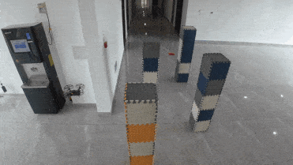
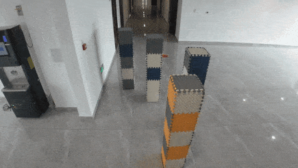
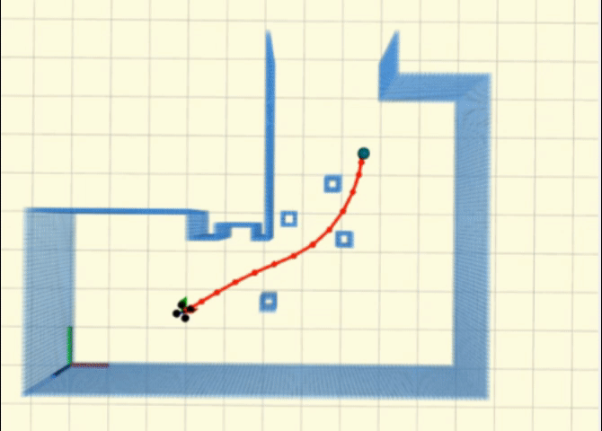
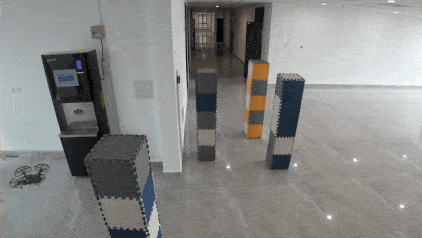

# RQ1:What vulnerabilities can DPFuzzer reveals?
Code for replaying these scenarios is available in `RQ1` directory.

## Videos

### 8 types of vulnerabilities

<p align = "center">
<div style="position: relative; display: inline-block;">
  <div style="position: absolute; top: 0; left: 0; background-color: rgba(255, 255, 255, 0.9); padding: 8px;">
    <b style="font-size: 32px;">#1</b>
  </div>
  
</div>

<div style="position: relative; display: inline-block;">
  <div style="position: absolute; top: 0; left: 0; background-color: rgba(255, 255, 255, 0.9); padding: 8px;">
    <b style="font-size: 32px;">#2</b>
  </div>
  
</div>
</p>

<p align = "center">
<div style="position: relative; display: inline-block;">
  <div style="position: absolute; top: 0; left: 0; background-color: rgba(255, 255, 255, 0.9); padding: 8px;">
    <b style="font-size: 32px;">#3</b>
  </div>
  
</div>

<div style="position: relative; display: inline-block;">
  <div style="position: absolute; top: 0; left: 0; background-color: rgba(255, 255, 255, 0.9); padding: 8px;">
    <b style="font-size: 32px;">#4</b>
  </div>
  
</div>
</p>

<p align = "center">
<div style="position: relative; display: inline-block;">
  <div style="position: absolute; top: 0; left: 0; background-color: rgba(255, 255, 255, 0.9); padding: 8px;">
    <b style="font-size: 32px;">#5</b>
  </div>
  
</div>

<div style="position: relative; display: inline-block;">
  <div style="position: absolute; top: 0; left: 0; background-color: rgba(255, 255, 255, 0.9); padding: 8px;">
    <b style="font-size: 32px;">#6</b>
  </div>
  
</div>
</p>

<p align = "center">
<div style="position: relative; display: inline-block;">
  <div style="position: absolute; top: 0; left: 0; background-color: rgba(255, 255, 255, 0.9); padding: 8px;">
    <b style="font-size: 32px;">#7</b>
  </div>
  
</div>

<div style="position: relative; display: inline-block;">
  <div style="position: absolute; top: 0; left: 0; background-color: rgba(255, 255, 255, 0.9); padding: 8px;">
    <b style="font-size: 32px;">#8</b>
  </div>
  
</div>
</p>

# RQ2:How effective is DPFuzzer?
Data in RQ2 is available in `RQ2` directory.

The `data` folder contains all the data in `Table II`

### Folder structure description


`tree data -L 3`

```bash
data
├── D-GA    #scenarios generated by D-GA
│   ├── ......
├── Ours    #scenarios generated by DPFuzzer
│   ├── Ego-Planner    #path planner under test
│   │   ├── S1    #scenario
│   │   ├── S2
│   │   ├── S3
│   │   └── S4
│   └── Ego-Planner-Swarm    #path planner under test
│       ├── S1
│       ├── S2
│       ├── S3
│       └── S4
└── Rand    #scenarios generated by Rand
    └── ......
```

`tree data/Ours/Ego-Planner/S1/ -L 2`

```bash
S1
├── 1    #replicates experiments, 5 runs
│   ├── misbehaviour    #scenarios which trigger misbehaviours
│   └── scenarios    #all the generated scenarios
├── 2
│   ├── misbehaviour
│   └── scenarios
├── 3
│   ├── misbehaviour
│   └── scenarios
├── 4
│   ├── misbehaviour
│   └── scenarios
└── 5
    ├── misbehaviour
    └── scenarios

```


### Scenario Description
`cat data/Ours/Ego-Planner/S1/1/misbehaviour/4/immobility/1.json`

```bash
{
    "boundaries": # boundary obstacles description
        [
            ["wall", [[0, 6, -0.2], [0, -6, -0.2], 3.2]], 
            ["wall", [[0, -6, -0.2], [8, -6, -0.2], 3.2]], 
            ["wall", [[8, -6, -0.2], [8, 3, -0.2], 3.2]], 
            ["wall", [[8, 3, -0.2], [5, 3, -0.2], 3.2]], 
            ["wall", [[5, 3, -0.2], [5, 6, -0.2], 3.2]], 
            ["wall", [[5, 6, -0.2], [0, 6, -0.2], 3.2]], 
            ["wall", [[0, 3, -0.2], [2.2, 3, -0.2], 3.2]], 
            ["wall", [[4, 3, -0.2], [5, 3, -0.2], 3.2]], 
            ["wall", [[0, -1.5, -0.2], [3, -1.5, -0.2], 3.2]], 
            ["wall", [[5, -1.5, -0.2], [8, -1.5, -0.2], 3.2]], 
            ["wall", [[5, -1.5, -0.2], [5, -2, -0.2], 3.2]], 
            ["wall", [[3, -3, -0.2], [3, -6, -0.2], 3.2]], 
            ["wall", [[5, -3.5, -0.2], [5, -6, -0.2], 3.2]], 
            ["wall", [[5, -3.5, -0.2], [6, -3.5, -0.2], 3.2]], 
            ["wall", [[7.5, -3.5, -0.2], [8, -3.5, -0.2], 3.2]]
        ], 

    "obstacles": # mutable obstacles description
        [
            ["square_cylinder", [0.2, 2.2, [3.0112563044950176, -0.8873376938009954, -0.2]]], 
            ["square_cylinder", [0.2, 2.2, [0.1584945493368206, 5.520409243333818, -0.2]]], 
            ["cylinder", [0.2, 2.2, [5.868166112163526, -2.896170638564372, -0.2]]], 
            ["square_cylinder", [0.2, 2.2, [6.1413452104383435, -1.6538411721152493, -0.2]]], 
            ["square_cylinder", [0.2, 2.2, [4.709048444965857, 3.720504821983043, -0.2]]]
        ]
}


```

# RQ3:Vulnerability exploitation in the real world.

The **Comparison** shows the drone can reach its destination in empty scenarios or scenarios with randomly arranged obstacles.

The **Cases** shows scenarios leading to incidents. Including in the simulator and the real world.

## Comparison
<p align = "center">
<div style="position: relative; display: inline-block;">
  <div style="position: absolute; top: 0; left: 0; background-color: rgba(255, 255, 255, 0.9); padding: 8px;">
    <b style="font-size: 24px;">Empty</b>
  </div>
  
</div>

<div style="position: relative; display: inline-block;">
  <div style="position: absolute; top: 0; left: 0; background-color: rgba(255, 255, 255, 0.9); padding: 8px;">
    <b style="font-size: 24px;">Random1</b>
  </div>
  
</div>

<div style="position: relative; display: inline-block;">
  <div style="position: absolute; top: 0; left: 0; background-color: rgba(255, 255, 255, 0.9); padding: 8px;">
    <b style="font-size: 24px;">Random2</b>
  </div>
  
</div>
</p>

## Case1
<p align = "center">
<div style="position: relative; display: inline-block;">
  <div style="position: absolute; top: 0; left: 0; background-color: rgba(255, 255, 255, 0.9); padding: 8px;">
    <b style="font-size: 32px;">Simulator</b>
  </div>
  
</div>
</p>

<p align = "center">
<div style="position: relative; display: inline-block;">
  <div style="position: absolute; top: 0; left: 0; background-color: rgba(255, 255, 255, 0.9); padding: 8px;">
    <b style="font-size: 32px;">Real World</b>
  </div>
  
</div>
</p>

## Case2
<p align = "center">
<div style="position: relative; display: inline-block;">
  <div style="position: absolute; top: 0; left: 0; background-color: rgba(255, 255, 255, 0.9); padding: 8px;">
    <b style="font-size: 32px;">Simulator</b>
  </div>
  
</div>

<div style="position: relative; display: inline-block;">
  <div style="position: absolute; top: 0; left: 0; background-color: rgba(255, 255, 255, 0.9); padding: 8px;">
    <b style="font-size: 32px;">Real World</b>
  </div>
  
</div>
</p>

## Case3
<p align = "center">
<div style="position: relative; display: inline-block;">
  <div style="position: absolute; top: 0; left: 0; background-color: rgba(255, 255, 255, 0.9); padding: 8px;">
    <b style="font-size: 32px;">Simulator</b>
  </div>
  
</div>

<div style="position: relative; display: inline-block;">
  <div style="position: absolute; top: 0; left: 0; background-color: rgba(255, 255, 255, 0.9); padding: 8px;">
    <b style="font-size: 32px;">Real World</b>
  </div>
  
</div>
</p>


# Fix Vulnerabilities
## Case1
Adjusted parameters
```bash
optimization/lambda_smooth:     1.0 -> 0.4
optimization/lambda_collision:  1.0 -> 3.0
```
<p align = "center">
<div style="position: relative; display: inline-block;">
  <div style="position: absolute; top: 0; left: 0; background-color: rgba(255, 255, 255, 0.9); padding: 8px;">
    <b style="font-size: 32px;">Before</b>
  </div>
  
</div>

<div style="position: relative; display: inline-block;">
  <div style="position: absolute; top: 0; left: 0; background-color: rgba(255, 255, 255, 0.9); padding: 8px;">
    <b style="font-size: 32px;">After</b>
  </div>
  
</div>
</p>

## Case2
Adjusted parameters
```bash
manager/feasibility_tolerance:  0.05 -> 0.15
optimization/lambda_smooth:     1.0 -> 0.6
```
<p align = "center">
<div style="position: relative; display: inline-block;">
  <div style="position: absolute; top: 0; left: 0; background-color: rgba(255, 255, 255, 0.9); padding: 8px;">
    <b style="font-size: 32px;">Before</b>
  </div>
  
</div>

<div style="position: relative; display: inline-block;">
  <div style="position: absolute; top: 0; left: 0; background-color: rgba(255, 255, 255, 0.9); padding: 8px;">
    <b style="font-size: 32px;">After</b>
  </div>
  
</div>
</p>
