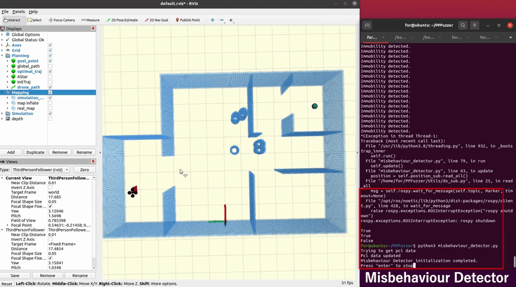
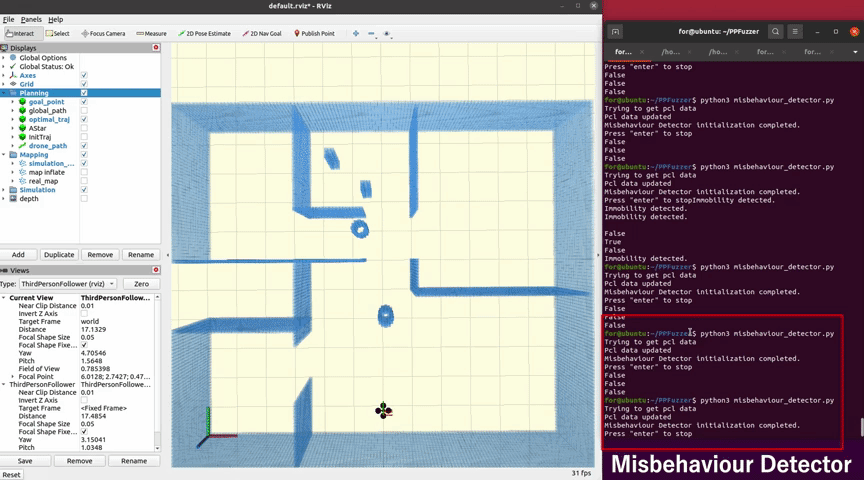
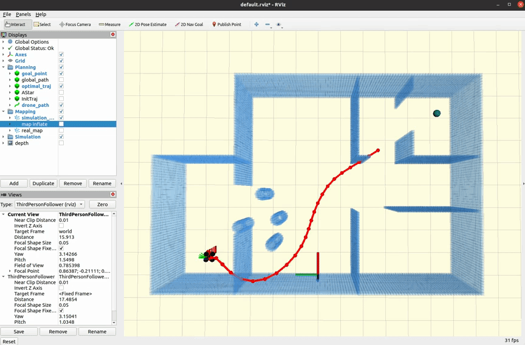

# RQ1:What vulnerabilities can DPFuzzer reveals?

The `src` directory contains source code for replaying vulnerabilities in RQ1.

## videos

  

    <b style="font-size: 32px;">#1</b>
  

  

  

    <b style="font-size: 32px;">#2</b>
  

  

  

    <b style="font-size: 32px;">#3</b>
  

  

  

    <b style="font-size: 32px;">#4</b>
  

  

  

    <b style="font-size: 32px;">#5</b>
  

  

  

    <b style="font-size: 32px;">#6</b>
  

  

  

    <b style="font-size: 32px;">#7</b>
  

  

  

    <b style="font-size: 32px;">#8</b>
  

  

