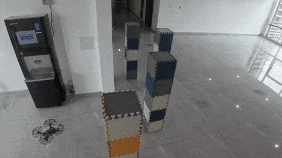

# RQ3:Vulnerability exploitation in the real world.

The **Comparison** shows the drone can reach destination in empty scenario or scenario with randomly arranged obstacles.

The **Cases** shows scenarios leading to incidents. Including in the simulator and the real world.

## Comparison

  

    <b style="font-size: 24px;">Empty</b>
  

  

  

    <b style="font-size: 24px;">Random1</b>
  

  

  

    <b style="font-size: 24px;">Random2</b>
  

  

## Case1

  

    <b style="font-size: 32px;">Simulator</b>
  

  

  

    <b style="font-size: 32px;">Real World</b>
  

  

## Case2

  

    <b style="font-size: 32px;">Simulator</b>
  

  

  

    <b style="font-size: 32px;">Real World</b>
  

  

## Case3

  

    <b style="font-size: 32px;">Simulator</b>
  

  

  

    <b style="font-size: 32px;">Real World</b>
  

  

